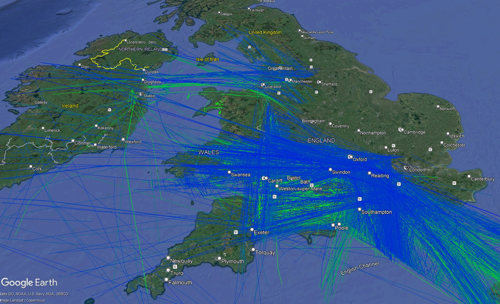
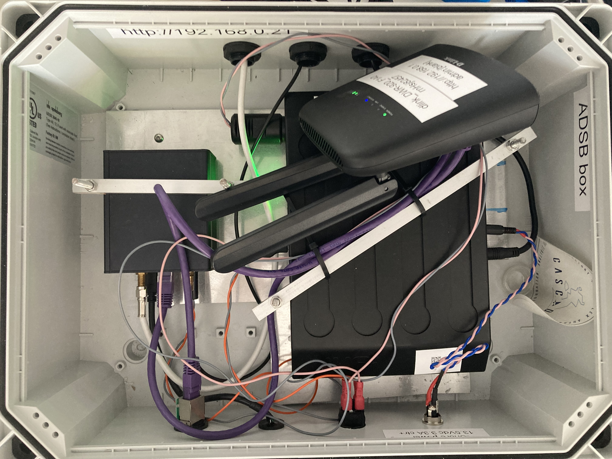

# ADS-B Monitoring

Recording and processing [ADS-B](https://en.wikipedia.org/wiki/Automatic_Dependent_Surveillance%E2%80%93Broadcast) data using a [Radarcape](https://wiki.jetvision.de/wiki/Radarcape:Contents)

## Software

Utilities are written for a companion computer connected to the same network as the Radarcape, mostly in Python with a bit of BASH.

### ADS-B Recording

The raw recording is just done in bash:
```
nc -C radarcape.local 30003 | grep -a MSG,[13] | split -l1000 -a4 -d --additional-suffix=.csv
```
This reads the [port 30003](http://woodair.net/sbs/Article/Barebones42_Socket_Data.htm) output, grabs only messages 1 and 3, and saves the results to files in chunks of 1000 lines.  The script `log_raw.sh` combines this with some nicety about making a folder with a timestamp.

### Processing

Script `data_to_results.py` converts the raw data to a more usable format, still CSV, but with each row as:
```
ID,date,time,altitude,latitude,longitude,callsign
```
This gives a row for each message of type 3 and looks up the callsign from the last message of type 1 with the same ID.

### Prettifying



`make_kml.py` searches the current folder and all subfolders, recursively, and combines any `data_***.csv` files it finds into one big KML file.

## Hardware

For standalone operation, the [Radarcape](https://wiki.jetvision.de/wiki/Radarcape:Contents) receiver is mounted in a waterproof enclosure with a [Hubi 2k](https://www.solartechnology.co.uk/product/hubi-go-2k/) solar power system.  A [D-Link DWR-920](https://eu.dlink.com/uk/en/products/dwr-920-wireless-n300-4g-lte-router) provides networking, including internet connectivity via 4G SIM and client connections via either WiFi or an external ethernet port.


